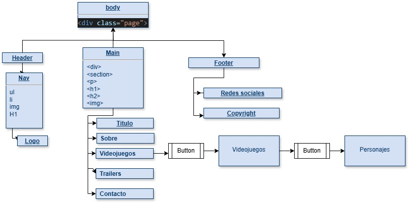
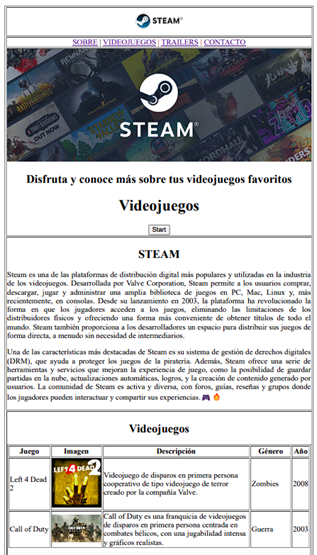
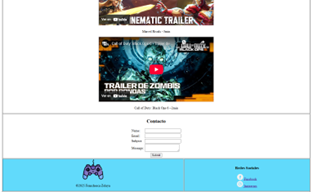
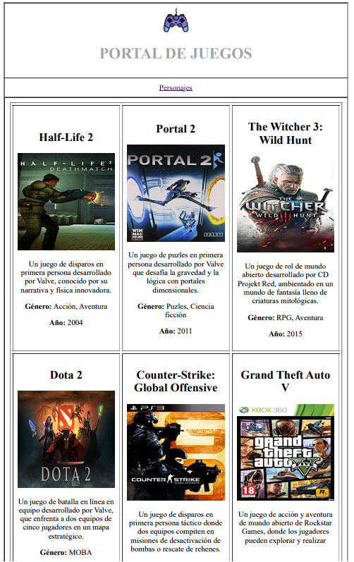
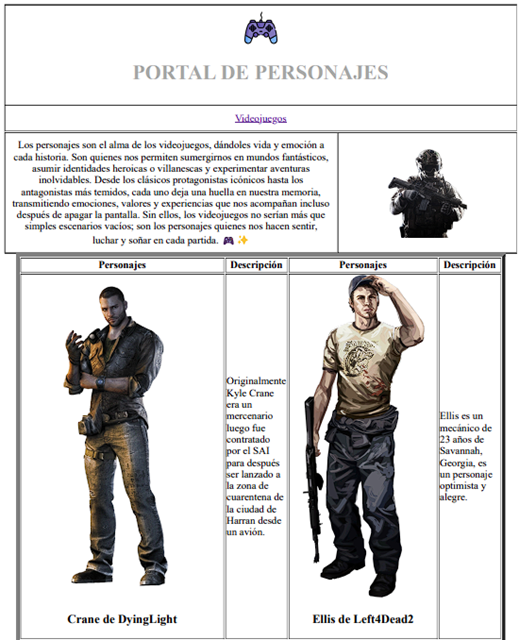

# Proyecto de Curso de Desarrollo Web

1. Introducción
Los videojuegos han evolucionado significativamente desde su aparición, convirtiéndose en una de las industrias más influyentes en el entretenimiento digital. Actualmente, no solo representan una forma de diversión, sino que también han impactado en áreas como la educación, la tecnología y la cultura popular.
Este informe tiene como objetivo detallar un mapa de sitio con el cual se desarrolló una página web de videojuegos, mostrando diferentes videojuegos, personajes, trailers.

2.	Marco Teórico
En la creación de páginas web, es fundamental comprender diversas herramientas y tecnologías que permiten su desarrollo y despliegue. En este marco teórico, se explicarán conceptos clave como HTML, Visual Studio Code, Vercel y etiquetas esenciales para la estructura y funcionalidad de una página web.
2.1 HTML (HyperText Markup Language)
HTML (Lenguaje de Marcado de Hipertexto) es el estándar para la creación de páginas web. Se basa en un sistema de etiquetas que estructuran el contenido, permitiendo la correcta visualización de textos, imágenes, enlaces, formularios y otros elementos en un navegador.
Algunas de las etiquetas básicas de HTML incluyen:
* <html>: Define el inicio y fin del documento HTML.
*	<head>: Contiene metadatos, enlaces a hojas de estilo y el título de la página.
*	<body>: Contiene el contenido visible de la página.
*	<h1> - <h6>: Encabezados de diferentes niveles.
*	
: Párrafos de texto.
*	<a>: Enlaces a otras páginas o recursos.
*	: Inserción de imágenes.
*	
 y : Elementos contenedores para estructurar contenido.
2.2. Visual Studio Code (VS Code)
Visual Studio Code es un editor de código fuente desarrollado por Microsoft. Es ampliamente utilizado en el desarrollo web debido a sus características como resaltado de sintaxis, integración con Git, extensiones para mejorar la productividad y soporte para múltiples lenguajes de programación.
2.3. Vercel
Vercel es una plataforma de despliegue en la nube que permite alojar aplicaciones y páginas web de manera rápida y eficiente. Es especialmente popular en proyectos desarrollados con tecnologías modernas como React, Next.js y aplicaciones estáticas basadas en HTML, CSS y JavaScript. Entre sus principales ventajas se encuentran el soporte para despliegue continuo, integración con GitHub y una infraestructura optimizada para la velocidad y escalabilidad.
2.4. Etiquetas de Formularios en HTML
Los formularios son una parte fundamental en muchas páginas web, ya que permiten la interacción con los usuarios. HTML ofrece diversas etiquetas para la creación de formularios:
*	<form>: Define un formulario.
*	<input>: Permite la inserción de datos, como texto, correos electrónicos, contraseñas, entre otros.
*	<label>: Asocia un texto descriptivo con un campo de entrada.
*	<textarea>: Campo de texto de varias líneas.
*	<select> y <option>: Menús desplegables.
*	<button>: Botón para enviar información o realizar acciones.
Estas etiquetas permiten capturar información del usuario y enviarla a un servidor para su procesamiento, facilitando la creación de sistemas de registro, inicio de sesión y otros formularios interactivos.
2.5. Etiquetas de Tablas en HTML
Las tablas en HTML son una forma estructurada de presentar información en filas y columnas. Se utilizan comúnmente para organizar datos y mejorar la visualización de contenidos en una página web.
Las etiquetas más utilizadas en tablas son:
*	<table>: Define una tabla.
*	<tr>: Representa una fila dentro de la tabla.
*	<td>: Define una celda de datos dentro de una fila.
*	<th>: Define una celda de encabezado, generalmente con texto en negrita.
*	<thead>: Agrupa los encabezados de la tabla.
*	<tbody>: Agrupa el cuerpo de la tabla.
*	<tfoot>: Agrupa el pie de la tabla.
*	colspan y rowspan: Permiten fusionar columnas y filas, respectivamente.
El uso de tablas es esencial en el desarrollo web para mostrar información estructurada de manera clara y accesible.

3. Mapa de sitio

El mapa de sitio presentado en la imagen representa la estructura jerárquica y la organización de los elementos de una página web enfocada en videojuegos. Se detallan las principales secciones del sitio, los elementos que las componen y la relación entre ellos.
3.1. Estructura General
El sitio web se encuentra estructurado dentro de la etiqueta <body>, con un contenedor principal identificado como 
. Dentro de este contenedor, se organizan tres grandes secciones:
-	Header (Encabezado)
-	Main (Contenido Principal)
-	Footer (Pie de Página)
3.2. Header (Encabezado)
El encabezado incluye la barra de navegación y el logo del sitio. 
Sus elementos son:
-	Nav (Navegación): Una lista no ordenada (<ul>) con elementos de lista (<li>). Que tendrá: Sobre, Videojuegos, Trailers y Contacto
-	Imágenes (), para el logo
-	Logo: Imagen representativa del sitio web.
3.3. Main (Contenido Principal)
La sección principal del sitio está compuesta por diferentes elementos estructurados con etiquetas HTML clave:
Etiquetas utilizadas:

, <section>, 
, <h1>, <h2>, 
Subsecciones:
- Título
-	Sobre (sección informativa sobre los videojuegos).
-	Videojuegos (contenidos específicos sobre videojuegos).
-	Trailers (sección donde se podrían mostrar avances de juegos).
-	Contacto (formulario de contacto).
Dentro de la sección "Videojuegos", hay un botón (<button>) que redirige a otra página donde mostrara un portal de videojuegos.
Dentro de la sección "Portal de Videojuegos", hay un botón (<button>) que redirige a otra página donde mostrara personajes de videojuegos.
3.4. Footer (Pie de Página)
El pie de página incluye información adicional y enlaces complementarios:
-	Redes sociales (enlaces a plataformas como Facebook, Instagram).
-	Copyright, donde se detalla la información de derechos reservados del sitio web
3.5. Pestaña 1 (Portal de Videojuegos)
Solo mostrara información e imágenes de diferentes videojuegos con su respetiva imagen.
3.6. Pestaña 2 (Portal de Personajes)
Mostrara personajes en una tabla y su respectiva imagen.

4. Pagina Web
4.1. Vista principal

5. Hosting y dominio – Vercel
Para el hosting y dominio, escogí la plataforma Vercel, adjunto enlace del proyecto:
[Proyecto](https://steam-two-cyan.vercel.app/)
